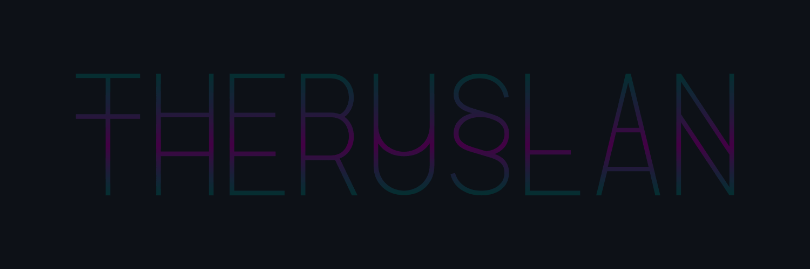

<picture>
  <source media="(prefers-color-scheme: dark)" srcset="assets/GitHub-Dark.png">
  <source media="(prefers-color-scheme: light)" srcset="assets/GitHub-Light.png">
  
</picture>

Hey, there!\
My name is **Ruslan Zaynetdinov** (he/him/his).

I am **web developer** & **design engineer** based in Yekaterinburg.\
I’m fond of both **code** and **design**.

In love with **motorcycles** and **mototravels**.\
**Vegan** since 2014.

[Website](https://theruslan.ru/) |
[Telegram](https://t.me/theruslan) |
[LinkedIn](https://www.linkedin.com/in/ruslanzaynetdinov) |
[Drupal.org](https://www.drupal.org/u/theruslan) |
[Facebook](https://www.facebook.com/theruslan.ru/) |
[Instagram](https://instagram.com/theruslan) |
[Twitter](https://twitter.com/The__Ruslan) |
[Bookmate](https://bookmate.com/@TheRuslan) |
[Strava](https://www.strava.com/athletes/theruslan)
